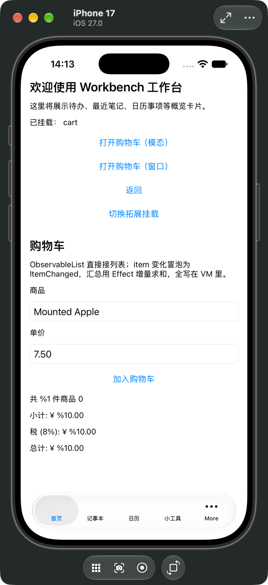

<div align="center">

# ✦ AriaTools

**Aria's cross-platform MVVM best practice** · plugin-based · modular · zero-logic views

One C++20 core, four platform view shells: Qt / iOS / Android / Web

[](https://en.cppreference.com/w/cpp/20)
[](https://github.com/dqsjqian/Aria)
[](LICENSE)
[](#)

[English](README.en.md) | [简体中文](README.md)

</div>

---

## 🎯 What is this?

**AriaTools** (formerly AiTools) is the flagship cross-platform example for [Aria](https://github.com/dqsjqian/Aria) (C++20 reactive MVVM framework) — and a **best-practice blueprint** for Aria's cross-platform architecture:

- **One pure-C++ core (Model + ViewModel + Service), four platform view shells** (Qt6 desktop / iOS UIKit / Android Compose / Web HTTP)
- **Plugin-style modular architecture**: 17 business modules, one static library each (`wb_module_<name>`); adding a module = one directory + one registration line
- **All logic sinks into the cross-platform layer** (VM/Model/Service); views only bind and render — no business computation, no state juggling, no hard-coded copy in views
- **Zero-logic views are enforced by architecture**: every platform resolves pages through a registration registry (QtViewFactory / UIViewFactory / ComposeViewFactory) keyed by module id

> In short: **AriaTools demonstrates "one ViewModel, four platforms"** — the ViewModel is a single C++ codebase; Qt / iOS / Android / Web each only write their own view shell.

## ✨ Key Features

- 🧩 **Plugin module architecture** — `IModule` contract + `make_<mod>_module()` factory + explicit `ModulesManifest` registration; modules depend only on core infrastructure (`ModuleContext`), never on each other
- 📦 **One module, one library** — single-line `wb_add_module()`; SOURCES (cross-platform logic) + QT_SOURCES / IOS_SOURCES / Android pages (platform views) compiled per-platform
- 🎛 **Strongly-typed MVVM** — View → ViewModel → Model → Service → infrastructure, DI via `ServiceHub`/Container; no Service Locator, no global singletons
- 🌍 **Internationalization** — XML i18n with runtime language switching; VM text properties auto-refresh (`BaseVm::text()`)
- 🔌 **Platform service injection** — UI-thread executor / worker pool / delayed scheduler injected by each platform shell into `ServiceHub`; modules get them via `ModuleContext` — business code stays platform-free
- 🖥 **Four platform shells** — Qt6 (desktop), iOS (UIKit), Android (Compose side-channel + native View/JniAdapter paths), Web (HTTP/REST/SSE thin client)
- 🧭 **Route presentation** — `NavigatorHost::Push<I>(payload, NavOptions)` picks HOW a target appears in one call: `Push` (stack-embedded) / `Modal` (dialog) / `Window` (standalone top-level window). Each shell maps it to the native presentation (Qt QStackedWidget / QDialog / top-level window; iOS child VC / present VC; Android embedded / Compose Dialog); closing a modal or window pops the stack entry
- 🧩 **Extension points (MountRegistry)** — `IModule::register_mounts` lets one module mount its UI into a slot another module declares (VS Code `contributes.views` / Eclipse extension-point pattern): `Provide(slotId, moduleId, factory)` / `Resolve(slotId)`; host and provider are fully decoupled (host only knows the slot id, provider never knows the host); `SetEnabled` hot-toggles, empty slots render a placeholder (graceful degradation); the mounted VM is the provider's PRIMARY instance — shares state with the module's own tab, so interaction is identical across all three platforms
- 🧪 **Framework Lab** — a real cross-platform module combining `ObservableList`, `FilteredList`, `Selection`, `Property` → `Computed` derivations, and `GraphInspector` snapshots in one shared C++ ViewModel.

## 🏗 Architecture

```
AriaTools/
├── Workbench/
│   ├── core/                     # ★ pure C++, zero platform-UI dependency
│   │   ├── utils/                #   wb_utils
│   │   ├── infra/                #   wb_infra (i18n/storage/settings/…) + DI + EventBus
│   │   ├── module_api/           #   wb_module_api (IModule/ModuleContext/BaseVm)
│   │   └── app/                  #   wb_core_app (AppCore + ModulesManifest)
│   ├── modules/<mod>/            # ★ business modules, one static lib each
│   │   ├── viewmodels/           #   VM: all business logic (Property/Computed/Command)
│   │   ├── models/ services/     #   Model / Service
│   │   ├── module/               #   business entry: IModule + VM factory
│   │   ├── platforms/qt/         #   View + separate ViewEntry (QT_SOURCES)
│   │   ├── platforms/ios/        #   UIKit View + separate ViewEntry (IOS_SOURCES)
│   │   ├── platforms/android/    #   Compose Page + separate PageEntry
│   │   └── assets/i18n/          #   module strings
│   └── platform/
│       ├── qt/                   #   Qt shell (QtViewFactory + UiHelpers)
│       ├── ios/                  #   iOS shell (UIViewFactory + IosUi)
│       ├── android/              #   Compose + typed JniAdapter lab
│       └── web/                  #   HTTP/REST/SSE shell + thin browser client
└── third_party/aria              # Aria framework (submodule)
```

**Data flow (JNI side-channel; identical shape on every platform)**:

```
C++ VM (aria::Property) → on_changed → JNI callback → Kotlin StateFlow → Compose recomposition
```

## 📦 Modules (17)

| Module | Purpose | Aria capabilities demonstrated |
|---|---|---|
| dashboard | Home overview | Property / i18n / extension-point host (mounted cart, hot-toggle) + cross-module nav (modal / window) |
| notes / calendar / tools | Notes / Calendar / Tools | ObservableList / forms |
| settings / sync | Settings / Sync | service injection / EventBus |
| tipcalc | Tip calculator | Computed / Command / reactive::batch |
| unitconvert | Unit converter | auto-tracking Computed |
| cart | Shopping cart | ObservableList derived collections |
| signup | Sign-up form | FormField / FormValidator |
| search | Search box | debounce / delayed scheduling |
| login | Fake login | AsyncCommand / executor injection |
| chat | Chat room | EventBus cross-module messaging |
| theme | Theme switch | Container DI |
| wizard | Sign-up wizard | multi-step form state machine |
| frameworklab | Framework capability lab | ObservableList + FilteredList + Selection / Property → Computed derivations / GraphInspector snapshots |
| echo | Hot-plug template | minimal module skeleton |

### Platform View contract

Every platform separates page implementation from platform registration:

| Platform | UI implementation | Registration entry |
|---|---|---|
| Qt | `<Mod>View.h/.cpp` | `<Mod>ViewEntry.cpp` |
| iOS | `<Mod>View.h/.mm` or ViewController | `<Mod>ViewEntry.mm` |
| Android | `<Mod>Page.kt` | `<Mod>PageEntry.kt` |

The business `module/<Mod>Module.cpp`, UI implementation, and platform Entry are three distinct layers. View/Page files must not register themselves with a Factory.

### Cross-module extension points (MountRegistry)

Besides *navigating* (pushing another module's page onto the stack), a module can *mount* its UI into a slot another module declares — the C++ take on VS Code `contributes.views` / Eclipse extension points, fully decoupled both ways:

```cpp
// provider (cart module, inside register_mounts)
mounts.Provide(wb::module_api::slots::kDashboardContent, id(),
               [](ModuleContext& ctx) {
                   return ctx.primary_vm("cart");  // shares state with the cart tab
               });

// host (dashboard module)
if (auto m = ctx.mounts().Resolve(slots::kDashboardContent)) {
    // render m->moduleId's UI via the View factory, data from m->vm
} else {
    render_placeholder();  // empty slot -> placeholder (graceful degradation)
}
```

- **Zero coupling**: the host only knows the slot id, the provider never knows who consumes it; deleting the provider module just empties the slot — no crash
- **Hot toggle**: `SetEnabled(slotId, bool)` keeps the provider factory and only flips the switch — dashboard's "toggle extension" button demonstrates it
- **Shared instance**: the mounted VM is the provider's PRIMARY instance, so the mounted UI and the module's tab show/edit the same data; Android side-channel command routing works with zero changes
- **Orthogonal to navigation**: navigation pushes a fresh page instance (returnable); mounting is a resident shared panel. The dashboard demonstrates both at once (mounted cart + modal/window navigation)

## 🖼 Cross-platform screenshots

AriaTools runs on the Aria framework plus native view shells per platform; one C++ ViewModel produces the same result on all four:

| Platform | Screenshot | Adapter |
|---|---|---|
| macOS (Qt6) |  | `aria-qt6` |
| iOS / UIKit |  | `aria-uikit` |
| Android (Compose side-channel) |  | `aria-jni` |
| Web (HTTP/REST/SSE) |  | `aria-http` |

> **Why no Windows / Linux screenshots?** The macOS shell is built on **Aria (the
> framework base) + the Qt6 adapter (the View layer)**; the Windows and Linux builds
> look identical to the macOS one (same Qt widgets + the same C++ ViewModel), so
> duplicate screenshots would add nothing. Windows additionally has two independently
> validated toolchains — MSVC + Qt6 and MSYS2 UCRT64.

## 🚀 Quick Start

```bash
git clone --recurse-submodules https://github.com/dqsjqian/AriaTools.git
cd AriaTools
```

### Qt desktop (macOS / Linux)

```bash
bash Workbench/scripts/gen-mac.sh            # configure + build (Release)
bash Workbench/scripts/gen-mac.sh run        # build and launch
```

### Qt desktop (Windows, MSVC + Qt6)

```powershell
pwsh Workbench/scripts/gen-win.ps1           # configure + build (Release)
pwsh Workbench/scripts/gen-win.ps1 run       # build and launch
pwsh Workbench/scripts/gen-win.ps1 probe     # build + verify every module and Qt View
pwsh Workbench/scripts/gen-win.ps1 tests     # build + run module tests
```

Toolchain auto-detection: vswhere probes the Visual Studio install (2022/2026), Windows Kits path is read from the registry, and Qt6 is auto-detected (e.g. `D:\worksoft\Qt`). Optional env vars: `$env:QT_DIR` to pin the Qt prefix, `$env:ARIA_VS_GENERATOR` to override the CMake generator.

### iOS (needs Xcode)

```bash
bash Workbench/scripts/gen-ios.sh            # generate Xcode project
bash Workbench/scripts/gen-ios.sh build      # generate + build simulator
```

### Android (needs NDK r26+ / SDK CMake 3.22.1)

```bash
bash Workbench/scripts/gen-android.sh        # core static libs only
bash Workbench/scripts/gen-android.sh --apk  # core + Gradle APK
```

### Web

```bash
bash Workbench/scripts/gen-web.sh build  # build the C++ HTTP shell
bash Workbench/scripts/gen-web.sh run    # serve http://127.0.0.1:19090
bash Workbench/scripts/gen-web.sh probe  # verify /aria/health + /aria/views
```

On Windows use the PowerShell twin (the Web shell has no Qt dependency):

```powershell
pwsh Workbench/scripts/gen-web.ps1 build
pwsh Workbench/scripts/gen-web.ps1 run
pwsh Workbench/scripts/gen-web.ps1 probe
```

The Web shell reuses the C++ `TipCalcVm`: browser input hops from an HTTP worker to the graph thread before writing `Property`; derived results return from `Computed` through `BindingEngine` and REST/SSE.

## 🛠 Tech Stack

| Area | Technology |
|---|---|
| Language | C++20 |
| Framework | [Aria](https://github.com/dqsjqian/Aria) (vendored, C++20 MVVM) |
| Desktop | Qt6 (macOS / Windows / Linux) |
| iOS | UIKit (Xcode project) |
| Android | Kotlin + Jetpack Compose side-channel; Android View + typed JniAdapter lab |
| Web | Aria HTTP adapter (REST/SSE) + thin browser client |
| Build | CMake + Gradle + Xcode |

## 📜 License

MIT © dqsjqian
