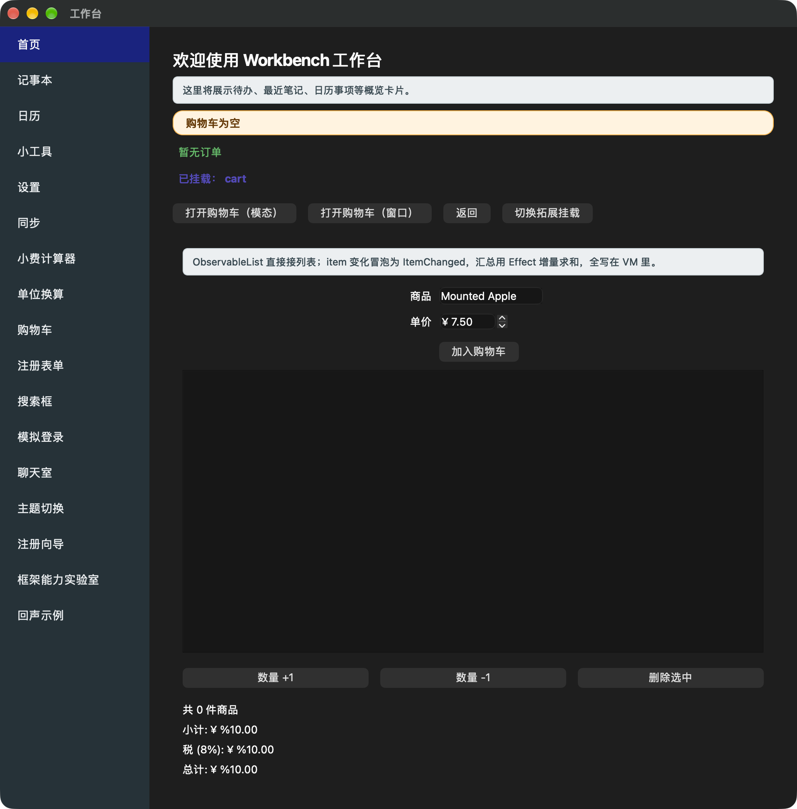
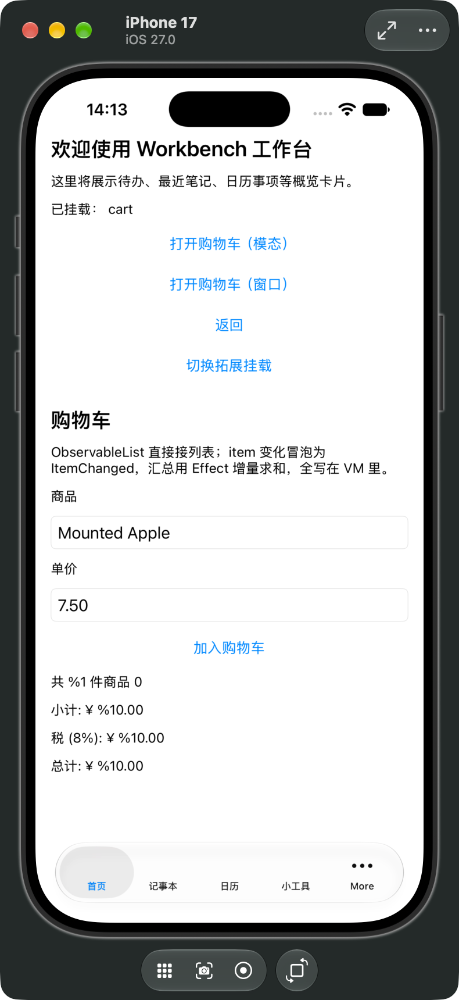
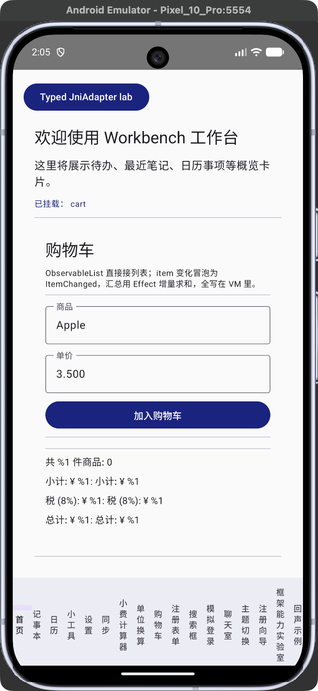
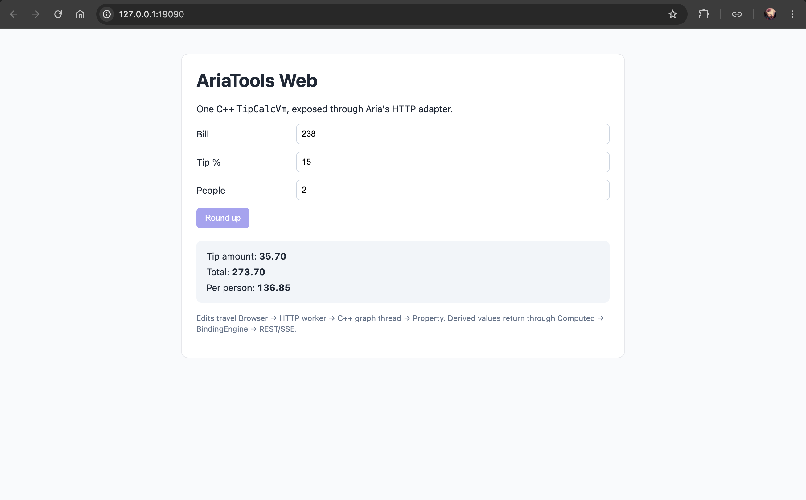

<div align="center">

# ✦ AriaTools

[Complete dependency update guide](docs/dependency-updates.en.md) — Version pins, selective updates, offline use, rollback and commit steps.

**Aria's cross-platform MVVM best practice** · plugin-based · modular · zero-logic views

One C++23 core, four platform view shells: Qt / iOS / Android / Web

[](https://en.cppreference.com/w/cpp/23)
[](https://github.com/dqsjqian/AriaTools/releases)
[](https://github.com/dqsjqian/Aria)
[](LICENSE)
[](#)

[English](README.en.md) | [简体中文](README.md)

</div>

See the [Workbench architecture guide](Workbench/docs/ARCHITECTURE.md) for directory responsibilities and module layering.

Dependencies retain their own licenses; see [third-party notices and distribution scope](THIRD_PARTY_NOTICES.md). Android builds package selected license texts and an input inventory in the APK's `assets/licenses/`.

---

## 🎯 What is this?

**AriaTools** (formerly AiTools) is the flagship cross-platform example for [Aria](https://github.com/dqsjqian/Aria) (C++23 reactive MVVM framework, Mira-powered HTTP transport) — and a **best-practice blueprint** for Aria's cross-platform architecture:

- **One pure-C++ core (Model + ViewModel + Service), four platform view shells** (Qt6 desktop / iOS UIKit / Android Compose / Web HTTP)
- **Plugin-style modular architecture**: 17 business modules, one static library each (`wb_module_<name>`); adding a module = one directory + one registration line
- **All logic sinks into the cross-platform layer** (VM/Model/Service); views only bind and render — no business computation, no state juggling, no hard-coded copy in views
- **Zero-logic views are enforced by architecture**: every platform resolves pages through a registration registry (QtViewFactory / UIViewFactory / ComposeViewFactory) keyed by module id

> In short: **AriaTools demonstrates "one ViewModel, four platforms"** — the ViewModel is a single C++ codebase; Qt / iOS / Android / Web each only write their own view shell.

## ✨ Key Features

- 🧩 **Plugin module architecture** — `IModule` contract + `make_<mod>_module()` factory + explicit `ModulesManifest` registration; modules depend only on core infrastructure (`ModuleContext`), never on each other
- 📦 **One module, one library** — single-line `wb_add_module()`; SOURCES (cross-platform logic) + QT_SOURCES / IOS_SOURCES / Android pages (platform views) compiled per-platform
- 🎛 **Strongly-typed MVVM** — View → ViewModel → Model → Service → infrastructure, DI via `ServiceHub`/Container; no Service Locator, no global singletons
- 🌍 **Internationalization** — XML i18n with runtime language switching; VM text properties auto-refresh (`BaseVm::text()`)
- 🔌 **Platform service injection** — UI-thread executor / worker pool / delayed scheduler injected by each platform shell into `ServiceHub`; modules get them via `ModuleContext` — business code stays platform-free
- 🖥 **Four platform shells** — Qt6 (desktop), iOS (UIKit), Android (Compose side-channel + native View/JniAdapter paths), Web (HTTP/REST/SSE thin client)
- 🧭 **Route presentation** — `NavigatorHost::Push<I>(payload, NavOptions)` picks HOW a target appears in one call: `Push` (stack-embedded) / `Modal` (dialog) / `Window` (standalone top-level window). Each shell maps it to the native presentation (Qt QStackedWidget / QDialog / top-level window; iOS child VC / present VC; Android embedded / Compose Dialog); closing a modal or window pops the stack entry
- 🧩 **Extension points (MountRegistry)** — `IModule::register_mounts` lets one module mount its UI into a slot another module declares (VS Code `contributes.views` / Eclipse extension-point pattern): `Provide(slotId, moduleId, factory)` / `Resolve(slotId)`; host and provider are fully decoupled (host only knows the slot id, provider never knows the host); `SetEnabled` hot-toggles, empty slots render a placeholder (graceful degradation); the mounted VM is the provider's PRIMARY instance — shares state with the module's own tab, so interaction is identical across all three platforms
- 🧪 **Framework Lab** — a real cross-platform module combining `ObservableList`, `FilteredList`, `Selection`, `Property` → `Computed` derivations, and `GraphInspector` snapshots in one shared C++ ViewModel.

## 🏗 Architecture

```
AriaTools/
├── Workbench/
│   ├── core/                     # ★ pure C++, zero platform-UI dependency
│   │   ├── utils/                #   wb_utils
│   │   ├── infra/                #   wb_infra (i18n/storage/settings/…) + DI + EventBus
│   │   ├── module_api/           #   wb_module_api (IModule/ModuleContext/BaseVm)
│   │   └── app/                  #   wb_core_app (AppCore + ModulesManifest)
│   ├── modules/<mod>/            # ★ business modules, one static lib each
│   │   ├── viewmodels/           #   VM: all business logic (Property/Computed/Command)
│   │   ├── models/ services/     #   Model / Service
│   │   ├── module/               #   business entry: IModule + VM factory
│   │   ├── platforms/qt/         #   View + separate ViewEntry (QT_SOURCES)
│   │   ├── platforms/ios/        #   UIKit View + separate ViewEntry (IOS_SOURCES)
│   │   ├── platforms/android/    #   Compose Page + separate PageEntry
│   │   └── assets/i18n/          #   module strings
│   └── platform/
│       ├── qt/                   #   Qt shell (QtViewFactory + UiHelpers)
│       ├── ios/                  #   iOS shell (UIViewFactory + IosUi)
│       ├── android/              #   Compose + typed JniAdapter lab
│       └── web/                  #   HTTP/REST/SSE shell + thin browser client
└── build/deps/aria               # Aria framework (pinned fetch: scripts/ci/fetch_aria.py)
```

**Data flow (JNI side-channel; identical shape on every platform)**:

```
C++ VM (aria::Property) → on_changed → JNI callback → Kotlin StateFlow → Compose recomposition
```

## 📦 Modules (17)

| Module | Purpose | Aria capabilities demonstrated |
|---|---|---|
| dashboard | Home overview | Property / i18n / extension-point host (mounted cart, hot-toggle) + cross-module nav (modal / window) |
| notes / calendar / tools | Notes / Calendar / Tools | ObservableList / forms |
| settings / sync | Settings / Sync | service injection / EventBus |
| tipcalc | Tip calculator | Computed / Command / reactive::batch |
| unitconvert | Unit converter | auto-tracking Computed |
| cart | Shopping cart | ObservableList derived collections |
| signup | Sign-up form | FormField / FormValidator |
| search | Search box | debounce / delayed scheduling |
| login | Fake login | AsyncCommand / executor injection |
| chat | Chat room | EventBus cross-module messaging |
| theme | Theme switch | Container DI |
| wizard | Sign-up wizard | multi-step form state machine |
| frameworklab | Framework capability lab | ObservableList + FilteredList + Selection / Property → Computed derivations / GraphInspector snapshots |
| echo | Hot-plug template | minimal module skeleton |

### Platform View contract

Every platform separates page implementation from platform registration:

| Platform | UI implementation | Registration entry |
|---|---|---|
| Qt | `<Mod>View.h/.cpp` | `<Mod>ViewEntry.cpp` |
| iOS | `<Mod>View.h/.mm` or ViewController | `<Mod>ViewEntry.mm` |
| Android | `<Mod>Page.kt` | `<Mod>PageEntry.kt` |

The business `module/<Mod>Module.cpp`, UI implementation, and platform Entry are three distinct layers. View/Page files must not register themselves with a Factory.

### Cross-module extension points (MountRegistry)

Besides *navigating* (pushing another module's page onto the stack), a module can *mount* its UI into a slot another module declares — the C++ take on VS Code `contributes.views` / Eclipse extension points, fully decoupled both ways:

```cpp
// provider (cart module, inside register_mounts)
mounts.Provide(wb::module_api::slots::kDashboardContent, id(),
               [](ModuleContext& ctx) {
                   return ctx.primary_vm("cart");  // shares state with the cart tab
               });

// host (dashboard module)
if (auto m = ctx.mounts().Resolve(slots::kDashboardContent)) {
    // render m->moduleId's UI via the View factory, data from m->vm
} else {
    render_placeholder();  // empty slot -> placeholder (graceful degradation)
}
```

- **Zero coupling**: the host only knows the slot id, the provider never knows who consumes it; deleting the provider module just empties the slot — no crash
- **Hot toggle**: `SetEnabled(slotId, bool)` keeps the provider factory and only flips the switch — dashboard's "toggle extension" button demonstrates it
- **Shared instance**: the mounted VM is the provider's PRIMARY instance, so the mounted UI and the module's tab show/edit the same data; Android side-channel command routing works with zero changes
- **Orthogonal to navigation**: navigation pushes a fresh page instance (returnable); mounting is a resident shared panel. The dashboard demonstrates both at once (mounted cart + modal/window navigation)

## 🖼 Cross-platform screenshots

AriaTools runs on the Aria framework plus native view shells per platform; one C++ ViewModel produces the same result on all four:

| Platform | Screenshot | Adapter |
|---|---|---|
| macOS (Qt6) |  | `aria-qt6` |
| iOS / UIKit |  | `aria-uikit` |
| Android (Compose side-channel) |  | `aria-jni` |
| Web (HTTP/REST/SSE) |  | `aria-http` |

> **Why no Windows / Linux screenshots?** The macOS shell is built on **Aria (the
> framework base) + the Qt6 adapter (the View layer)**; the Windows and Linux builds
> look identical to the macOS one (same Qt widgets + the same C++ ViewModel), so
> duplicate screenshots would add nothing. Windows additionally has two independently
> validated toolchains — MSVC + Qt6 and MSYS2 UCRT64.

## Portable Python entry

`python scripts/build.py --platform qt` reuses the locked dependency fetcher and
builds the Qt app; `--platform web|ios|android` selects the implemented native
shell/core. Use `--dry-run` for a read-only command plan, `--offline` for cached
dependencies. For desktop builds, `--test` separately configures, builds and runs
the six module CTest projects: calendar, cart, dashboard, frameworklab, notes and
tools. Mobile execution still requires a simulator or device runner. Build
directories isolate platform, toolchain, configuration, architecture and iOS SDK. Android requires `--ndk`;
iOS requires macOS/Xcode. This entry does not package APKs or deploy/sign device
apps: retain the existing platform scripts for those actions. Windows MSVC with
external TLS dependencies still requires a developer environment and Perl/NASM;
MSYS2 UCRT64 requires make, perl and git.

On macOS, `--arch x86_64` / `--arch arm64` selects the actual architecture of
both the app and module tests. Visual Studio accepts `--generator-platform x64`
(or `ARM64`). `--cmake-arg=-DNAME[:TYPE]=VALUE` adds CMake definitions without
overriding the selected configuration, source or platform. Existing build caches
are checked for compiler, toolchain, architecture and dependency-path conflicts
before fetching or configuring; choose another build directory on conflict.

## 🚀 Quick Start

```bash
git clone https://github.com/dqsjqian/AriaTools.git
cd AriaTools
python scripts/ci/fetch_aria.py
```

C++ builds require CMake 3.21 or newer, matching Mira 1.0.0.

The single root `dependencies.json` contains version requests and each dependency’s `resolved` result. Without an explicit version or a matching lock, the first resolution selects the latest stable release and records its version, commit, and SHA256. Existing locks are reused, so ordinary builds do not follow new releases. Explicit versions take priority: for example, `python scripts/ci/fetch_aria.py --version 3.1.1` overrides `ARIA_DEP_ARIA_VERSION`. Run `python scripts/ci/fetch_aria.py --update` to upgrade Aria deliberately.

Override C++ libraries with options such as `-DARIA_DEP_JSON_VERSION=3.12.0`, `-DARIA_DEP_MIRA_VERSION=1.0.0`, and `-DARIA_DEP_OPENSSL_VERSION=4.0.3`. CMake records temporary overrides in a build-directory resolution cache without changing the source `dependencies.json`. To update the shared library lock, run `python scripts/ci/update_dependencies.py`, review the changes, and commit this dependency file. Explicit source overrides and dependency targets supplied by a parent project retain priority.

Qt uses installed SDKs and never downloads or installs them automatically. The default prefers the latest discoverable version; `-DARIA_DEP_QT_VERSION=6.8.3` requires that exact version. Use `Qt6_DIR` / `CMAKE_PREFIX_PATH` to select an SDK location.

Run the fetcher again after dependency updates: it verifies the actual Git HEAD, refuses to overwrite local edits, keeps the current checkout if fetching fails, and retains a successful upgrade's previous checkout under `build/deps/aria-backup-*`.

Aria lives in Git-ignored `build/deps/aria`; external dependencies such as JSON enter the build cache after version and SHA256 verification. The project uses no `third_party` source copies or Git submodules.

To obtain the locked Aria commit from a local repository, run `python scripts/ci/fetch_aria.py --source /path/to/Aria`, or set `ARIA_SOURCE`; `--source` takes precedence. The source must contain the exact commit selected by the lock.

Both the main project and standalone module tests support `-DARIA_DIR=/path/to/Aria`, for example:

```bash
cmake -S Workbench/modules/cart/tests -B build/mac/modules/cart -DARIA_DIR=/path/to/Aria
cmake --build build/mac/modules/cart -j3
ctest --test-dir build/mac/modules/cart --output-on-failure
python scripts/ci/test_fetch_aria.py  # local fetcher safety regressions
```

`ARIA_DIR` uses that source tree directly without pin verification; the default dependency path remains `build/deps/aria`. CMake configuration does not run the fetcher automatically.

Android Compose / Activity / Lifecycle use a compatibility profile, native Gradle dependency locks, and SHA256 verification for the transitive graph. Run `python scripts/ci/android_dependencies.py update` for a deliberate upgrade; see [Android dependencies](docs/android-dependencies.md) for SDK prerequisites, explicit overrides, and lock files.

### Qt desktop (macOS / Linux)

```bash
bash Workbench/scripts/gen-mac.sh            # configure + build (Release)
bash Workbench/scripts/gen-mac.sh run        # build and launch
```

### Qt desktop (Windows, MSVC + Qt6)

```powershell
pwsh Workbench/scripts/gen-win.ps1           # configure + build (Release)
pwsh Workbench/scripts/gen-win.ps1 run       # build and launch
pwsh Workbench/scripts/gen-win.ps1 probe     # build + verify every module and Qt View
pwsh Workbench/scripts/gen-win.ps1 tests     # build + run module tests
```

Toolchain auto-detection: vswhere probes the Visual Studio install (2022/2026), Windows Kits path is read from the registry, and Qt6 is auto-detected from `QT_DIR` or standard Qt installation folders. Optional env vars: `$env:QT_DIR` to pin the Qt prefix, `$env:ARIA_VS_GENERATOR` to override the CMake generator.

### iOS (needs Xcode)

```bash
bash Workbench/scripts/gen-ios.sh            # generate Xcode project
bash Workbench/scripts/gen-ios.sh build      # generate + build simulator (no signing)
WB_IOS_DEV_TEAM=YOUR_TEAM_ID bash Workbench/scripts/gen-ios.sh device # build and install on a device
```

### Android (locked toolchain profile)

Install the SDK/NDK/CMake and JDK selected by the
[Android dependency profile](docs/android-dependencies.md). The current profile
uses NDK 29, compile SDK 37 and JDK 17. The script reads exact toolchain versions
from `android-dependencies.json`; the native core and APK must use the same selection.

```bash
bash Workbench/scripts/gen-android.sh        # core static libs only
bash Workbench/scripts/gen-android.sh --apk  # core + Gradle APK
```

### Web

```bash
bash Workbench/scripts/gen-web.sh build  # build the C++ HTTP shell
bash Workbench/scripts/gen-web.sh run    # serve http://127.0.0.1:19090
bash Workbench/scripts/gen-web.sh probe  # verify /aria/health + /aria/views
```

On Windows use the PowerShell twin (the Web shell has no Qt dependency):

```powershell
pwsh Workbench/scripts/gen-web.ps1 build
pwsh Workbench/scripts/gen-web.ps1 run
pwsh Workbench/scripts/gen-web.ps1 probe
```

The Web shell reuses the C++ `TipCalcVm`: browser input hops from an HTTP worker to the graph thread before writing `Property`; derived results return from `Computed` through `BindingEngine` and REST/SSE.

## 🛠 Tech Stack

| Area | Technology |
|---|---|
| Language | C++23 |
| Framework | [Aria](https://github.com/dqsjqian/Aria) (pinned fetch, C++23 MVVM) |
| Desktop | Qt6 (macOS / Windows / Linux) |
| iOS | UIKit (Xcode project) |
| Android | Kotlin + Jetpack Compose side-channel; Android View + typed JniAdapter lab |
| Web | Aria HTTP adapter (REST/SSE) + thin browser client |
| Build | CMake + Gradle + Xcode |

## 📜 License

MIT © dqsjqian
