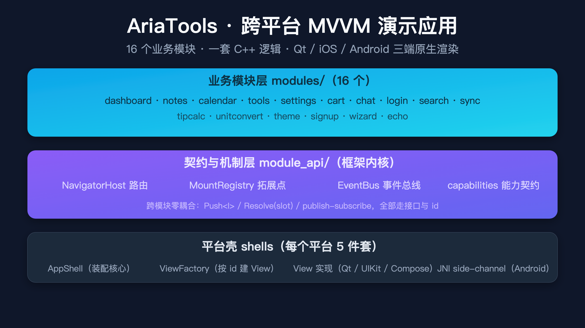
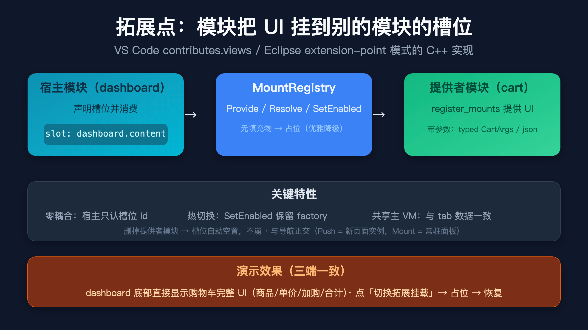

# C++20 写的 GUI，也能三端一套？16 个模块的跨平台 MVVM 实战

> 一个跨 Qt / iOS / Android 三端的演示应用，一份 C++ 业务逻辑，原生 UI 渲染，外加一套自研的 C++20 响应式框架底座。


---

## 😩 痛点

C++ 写 GUI，长期被几个老问题卡住：

- **平台 UI 代码重复一遍又一遍**：同样的购物车逻辑，Qt 写一份、iOS UIKit 写一份、Android Compose 再写一份，"复制粘贴 + 平台差补丁"成了日常
- **业务逻辑和 UI 绞在一起**：想做"加购后首页徽章刷新"，得在 View 监听事件再回调 View，互相耦合
- **跨模块通信靠全局变量或单例**：加一个模块要改一堆 include
- **C++ 响应式 UI 框架稀缺**：React/Vue 有响应式引擎，Qt 有 Q_PROPERTY，iOS/Android 各自一套原生绑定——C++ 这边要自己造

## 💡 解决方案

**Aria**（[github.com/dqsjqian/Aria](https://github.com/dqsjqian/Aria)，MIT）是一套自研的 **C++20 MVVM 框架**，给"原生 C++ GUI 写现代响应式 UI"补齐短板：

- **响应式核心**：`Property`（单值）/ `ObservableList`（列表）/ `Computed`（自动派生）/ `Command`（用户动作）/ `Subscription`（生命周期），一整套跟 React/Vue 一样的观察者语义
- **绑定引擎 `BindingEngine`**：`bind_text_oneway(vm.title, label)` 一行代码把 VM 状态推到 View
- **平台适配器**：`UIKitAdapter` / `QtViewFactory` / `ComposeViewFactory` / `HttpAdapter`（Web），业务 VM 不动
- **协程原生支持**：`AsyncCommand` 自动调度到 UI 线程，线程亲和不变量帮你保住反应式的不变量

> 本文要介绍的是基于 Aria 写的演示应用 **AriaTools**——16 个真实业务模块，把 Aria 框架的能力跑了一遍。

---



## 🎁 AriaTools 是什么

**AriaTools** = 16 个真实业务模块（dashboard / notes / calendar / tools / settings / cart / chat / login / search / sync / tipcalc / unitconvert / theme / signup / wizard / echo），每个都跑在 Qt / iOS / Android 三端，**业务逻辑完全共享 C++ 源码**，只有 View 适配器是平台原生。

| 特性 | 怎么做的 |
|---|---|
| **跨平台** | 16 个模块 · 一份 C++ 业务 · Qt/iOS/Android 原生渲染 |
| **零耦合通信** | `EventBus::publish / subscribe`，dashboard 不知道谁发的 ItemAddedToCart，照样刷新徽章 |
| **跨模块导航** | `NavigatorHost::Push<ICartPage>(CartArgs{...})` 一行调用，VM 层完成 typed payload 投递 |
| **三种呈现** | Push（栈内嵌）/ Modal（模态对话框）/ Window（独立顶层窗口），各端 View 自己映射原生 |
| **i18n** | XML 资源 + `BaseVm::text()`，运行时切语言所有文本自动刷新 |

---

## ✨ 三个真正戳到我的设计

### 1. 一套业务三端

一个 `CartVm` 同时出现在三端的购物车页 + dashboard 的挂载面板 + 模态弹窗——**同一份状态同一份数据**，三端 UI 跟响应式引擎自动同步。

### 2. 跨模块导航：typed payload + 三种呈现

```cpp
// 任意模块的 VM
ctx.navigator().Push<wb::module_api::ICartPage>(
    wb::module_api::CartArgs{.product = "Apple", .price = 2.5},
    wb::module_api::NavOptions{
        .presentation = wb::module_api::Presentation::Modal  // 或 Push / Window
    });
```

两种 channel：typed struct（编译期字段检查）/ raw json（灵活）。三端 View 各自用原生方式呈现（Qt `QDialog` / iOS `present` / Android `Dialog`），关掉模态自动 `Pop` 栈条目。

### 3. 拓展点：MountRegistry（槽位挂载）

> 这是我觉得最"优雅"的一块——把"内嵌"从路由剥离出来，做成 VS Code `contributes.views` / Eclipse extension-point 模式的 C++ 实现。



**问题**：dashboard 想"把购物车挂在自己页面里"——传统做法写死引用，删掉 cart 模块就崩。

**MountRegistry 方案**：

```cpp
// 提供者（cart 的 register_mounts）
mounts.Provide(wb::module_api::DashboardSlots::kContent, id(),
               [](ModuleContext& ctx) {
                   return ctx.primary_vm("cart");  // 共享主 VM
               });

// 宿主（dashboard 解析）
auto m = ctx.mounts().Resolve<wb::module_api::IMountCartArgs>(
    wb::module_api::DashboardSlots::kContent,
    wb::module_api::CartArgs{.product = "Mounted Apple", .price = 7.5});
```

关键能力：
- **零耦合**：宿主只认槽位 id（`DashboardSlots::kContent`），cart 不知道谁挂载
- **双参数通道**：typed `CartArgs`（编译期检查）+ raw `json`（灵活），与导航完全对称
- **共享主 VM**：挂载的就是主 tab 的 VM，输入/加购直接同步到主 tab
- **`SetEnabled` 热切换**：保留 factory 只切开关，"切换拓展挂载"按钮实时演示
- **优雅降级**：无填充物 → 占位提示（"此区域可被其他模块扩展"），删模块槽位自动空置

---

## 📊 实测

- **dashboard_tests 65/65 PASS**（含 MountRegistry 语义、共享实例、typed/json 双通道、SetEnabled 热切换、导航三个呈现）
- **Qt macOS + iOS iPhone 17 Pro + Android 模拟器** 三端同时构建通过、运行稳定
- **iOS 端实测**：启动后 dashboard 底部直接渲染购物车完整 UI（商品/单价/加购/小计/税/总计），点"切换拓展挂载"变成占位，再点恢复

---

## 🚀 怎么跑

```bash
# Qt (macOS)
bash Workbench/scripts/gen-mac.sh

# iOS
bash Workbench/scripts/gen-ios.sh build

# Android
bash Workbench/scripts/gen-android.sh --apk
```

三端都自动构建、运行、截图验证。

---

## 📦 仓库

- **AriaTools**：https://github.com/dqsjqian/AriaTools
- **Aria 框架底座**：https://github.com/dqsjqian/Aria

⭐ **Star 一下**是给开源作者最大的鼓励！有问题 / 想贡献 / 想接入你们自己的模块，**提 Issue 即可**。

---

### 配图清单

- `images/aria-base.png` —— Aria 框架底座（响应式核心 + 绑定引擎 + 平台适配器）
- `images/ariatools-arch.png` —— AriaTools 三层架构（16 模块 / 契约机制 / 三端壳）
- `images/ariatools-ext.png` —— 拓展点槽位挂载（宿主 / MountRegistry / 提供者）

> 微信公众号推文，配图建议放标题下方与各小节开头。
